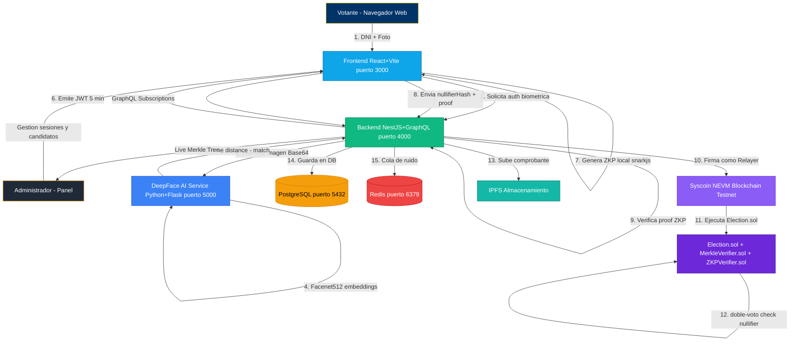

# 🏛️ UNT Digital Voting System

> **Sistema de votación universitaria criptográfico de vanguardia** diseñado para la **Universidad Nacional de Trujillo (UNT)**. Combina inmutabilidad Blockchain (**Syscoin NEVM**), privacidad absoluta (**Zero-Knowledge Proofs**) e identidad biométrica (**DeepFace AI**) dentro de una arquitectura de microservicios orquestada por Docker.

---

## 📑 Tabla de Contenidos

1. [Visión General](#visión-general)
2. [Stack Tecnológico](#stack-tecnológico)
3. [Arquitectura del Sistema](#arquitectura-del-sistema)
4. [Estructura del Proyecto](#estructura-del-proyecto)
5. [Microservicios](#microservicios)
6. [Módulos del Backend](#módulos-del-backend)
7. [Entidades de Base de Datos](#entidades-de-base-de-datos)
8. [Flujo Completo del Votante](#flujo-completo-del-votante)
9. [Privacidad: Estrategia de Ruido](#privacidad-estrategia-de-ruido-noise-voting)
10. [Variables de Entorno](#variables-de-entorno)
11. [Guía de Instalación y Despliegue](#guía-de-instalación-y-despliegue)
12. [Panel Administrativo](#panel-administrativo)
13. [API: DeepFace Endpoints](#api-deepface-endpoints)
14. [Smart Contracts](#smart-contracts)
15. [Scripts Útiles](#scripts-útiles)

---

## Visión General

El **UNT Digital Voting System** resuelve el problema de las elecciones universitarias fraudulentas mediante tres pilares criptográficos:

| Pilar | Tecnología | Garantía |
|---|---|---|
| 🧬 **Identidad** | DeepFace (Facenet512) | Solo vota quien dice ser |
| 🔒 **Privacidad** | Zero-Knowledge Proofs (snarkjs + Circom) | Nadie sabe por quién votaste |
| ⛓️ **Integridad** | Syscoin NEVM Blockchain | El voto no puede alterarse |

El votante **no necesita MetaMask ni wallet propia**. El servidor actúa como **Relayer** que paga el gas y firma las transacciones de forma anónima.

---

## Stack Tecnológico

### Backend
| Tecnología | Versión | Rol |
|---|---|---|
| NestJS | 10.x | Framework principal, GraphQL, módulos |
| TypeORM | 0.3.x | ORM y migraciones PostgreSQL |
| GraphQL / Apollo | 12.x / 4.x | API principal (queries, mutations, subscriptions) |
| Bull / Redis | 4.x / 7.x | Cola de trabajos asíncronos |
| snarkjs | 0.7.x | Verificación de Zero-Knowledge Proofs |
| ethers.js | 6.x | Comunicación con Syscoin NEVM |
| merkletreejs | 0.3.x | Construcción del Árbol de Merkle |
| ipfs-http-client | 60.x | Almacenamiento descentralizado |
| prom-client | 15.x | Métricas Prometheus |
| Winston | 3.x | Logging estructurado |
| JWT / Passport | 11.x / 0.7.x | Autenticación y guardas |
| Helmet / rate-limit | 7.x / 6.x | Seguridad HTTP |

### Frontend
| Tecnología | Versión | Rol |
|---|---|---|
| React | 18.x | UI framework |
| Vite | 4.x | Build tool y dev server |
| TypeScript | 5.x | Tipado estático |
| Chakra UI | 2.x | Sistema de diseño |
| Framer Motion | 10.x | Animaciones y transiciones |
| TanStack Query | 4.x | Cache y fetching de datos |
| graphql-request | 6.x | Cliente GraphQL ligero |
| react-router-dom | 6.x | Enrutamiento SPA |
| ethers.js | 6.x | Integración Web3 |
| wagmi / viem | 1.x | Hooks para wallet |
| recharts | 2.x | Gráficos del dashboard |
| react-qr-code | 2.x | Generación de código QR |

### Blockchain y Contratos
| Tecnología | Versión | Rol |
|---|---|---|
| Solidity | 0.8.19 | Lenguaje de smart contracts |
| Hardhat | - | Framework de desarrollo EVM |
| OpenZeppelin Upgrades | - | Contratos actualizables |
| Syscoin NEVM Testnet | chainId: 5700 | Red de prueba (Tanenbaum) |
| Syscoin NEVM Mainnet | chainId: 57 | Red de producción |

### AI / Biometría
| Tecnología | Versión | Rol |
|---|---|---|
| Python / Flask | 3.0 | Microservicio HTTP |
| DeepFace | 0.0.84 | Motor de reconocimiento facial |
| Facenet512 | - | Modelo de embeddings faciales |
| TensorFlow | 2.15 | Backend de cómputo |
| OpenCV Headless | 4.8 | Procesamiento de imágenes |
| scipy | 1.11 | Distancia coseno para comparación |

### Infraestructura
| Tecnología | Rol |
|---|---|
| Docker / Docker Compose | Orquestación de contenedores |
| PostgreSQL 16 | Base de datos relacional principal |
| Redis 7 | Cola de mensajes y caché |
| IPFS | Almacenamiento descentralizado de comprobantes |
| Nginx | Servidor estático del frontend |

---

## Arquitectura del Sistema



---

## Estructura del Proyecto

```
unt-voting-system/
│
├── apps/                          # Código fuente de las aplicaciones
│   ├── backend/                   # Microservicio principal (NestJS)
│   │   ├── src/
│   │   │   ├── app.module.ts      # Módulo raíz: registra todos los módulos
│   │   │   ├── main.ts            # Bootstrap, Helmet, CORS, rate-limit
│   │   │   ├── config/            # Configuración centralizada
│   │   │   │   ├── configuration.ts    # Factory de config global
│   │   │   │   ├── typeorm.config.ts   # Config de PostgreSQL
│   │   │   │   └── bull.config.ts      # Config de Redis/Bull
│   │   │   ├── common/            # Utilidades transversales
│   │   │   │   ├── decorators/    # @CurrentUser, @Roles, etc.
│   │   │   │   ├── filters/       # AllExceptionsFilter
│   │   │   │   ├── guards/        # JwtAuthGuard, RolesGuard
│   │   │   │   ├── health/        # Health check endpoint
│   │   │   │   ├── interceptors/  # LoggingInterceptor, TransformInterceptor
│   │   │   │   ├── interfaces/    # Tipos e interfaces compartidas
│   │   │   │   ├── metrics/       # Métricas Prometheus (prom-client)
│   │   │   │   └── scalars/       # Escalares GraphQL personalizados
│   │   │   ├── modules/           # Módulos de negocio
│   │   │   │   ├── voting/        # Lógica central de votación
│   │   │   │   │   ├── entities/
│   │   │   │   │   │   ├── session.entity.ts
│   │   │   │   │   │   ├── candidate.entity.ts
│   │   │   │   │   │   └── vote.entity.ts
│   │   │   │   │   ├── dto/
│   │   │   │   │   ├── voting.service.ts     # Lógica de negocio principal
│   │   │   │   │   ├── voting.resolver.ts    # Resolvers GraphQL
│   │   │   │   │   ├── voting.consumer.ts    # Consumer Bull (cola de votos)
│   │   │   │   │   └── voting.module.ts
│   │   │   │   ├── zkp/           # Zero-Knowledge Proofs
│   │   │   │   ├── blockchain/    # Comunicación con Syscoin NEVM
│   │   │   │   ├── merkle/        # Construcción del Árbol de Merkle
│   │   │   │   └── identity/      # Validación biométrica via DeepFace
│   │   │   └── seeds/             # Scripts de seeding de BD
│   │   ├── Dockerfile
│   │   ├── package.json
│   │   ├── tsconfig.json
│   │   ├── .env
│   │   └── .env.example
│   │
│   ├── frontend/                  # SPA del votante y administrador (React)
│   │   ├── src/
│   │   │   ├── App.tsx            # Router raíz: rutas públicas y admin
│   │   │   ├── main.tsx           # Entry point, ChakraProvider
│   │   │   ├── components/
│   │   │   │   ├── voting/        # Flujo de voto
│   │   │   │   ├── auth/          # Pantalla biométrica y login
│   │   │   │   ├── admin/         # Panel de administración
│   │   │   │   ├── dashboard/     # Gráficos y live Merkle Tree
│   │   │   │   └── common/        # Componentes reutilizables
│   │   │   ├── hooks/             # Custom hooks
│   │   │   ├── services/          # Clientes GraphQL y axios
│   │   │   ├── types/             # Tipos TypeScript globales
│   │   │   └── utils/             # Helpers
│   │   ├── index.html
│   │   ├── vite.config.ts
│   │   ├── nginx.conf             # Config Nginx para producción
│   │   ├── Dockerfile
│   │   └── package.json
│   │
│   ├── contracts/                 # Smart Contracts (Hardhat)
│   │   ├── contracts/
│   │   │   ├── Election.sol       # Contrato principal de elección
│   │   │   ├── MerkleVerifier.sol # Verificador Merkle on-chain
│   │   │   └── ZKPVerifier.sol    # Verificador ZKP Groth16
│   │   ├── scripts/
│   │   │   ├── deploy.js          # Despliegue de contratos
│   │   │   ├── createSession.js   # Crear sesión electoral on-chain
│   │   │   └── generateZKP.js     # Generación de pruebas ZKP
│   │   ├── artifacts/             # ABIs compilados (auto-generado)
│   │   ├── cache/
│   │   ├── hardhat.config.js      # Redes: Syscoin mainnet/testnet/local
│   │   └── package.json
│   │
│   └── mobile/                    # App móvil (en desarrollo)
│
├── deepface-service/              # Microservicio de biometría (Python)
│   ├── app.py                     # Flask API: /verify, /liveness, /identify
│   ├── requirements.txt           # Dependencias Python
│   └── Dockerfile
│
├── docker/                        # Orquestación Docker
│   ├── docker-compose.yml         # 5 servicios: backend, frontend, deepface, postgres, redis
│   ├── seed.sql                   # Datos iniciales: sesión + candidatos + alumnos
│   ├── check-session.sql          # Query de diagnóstico de sesión activa
│   ├── .env
│   └── .env.example
│
├── .gitignore
└── README.md
```

---

## Microservicios

### Backend (NestJS)

- **Puerto:** `4000`
- **Endpoint GraphQL:** `http://localhost:4000/graphql`
- **Playground:** Activo en `development`, deshabilitado en `production`
- **WebSockets:** Soporta `graphql-ws` y `subscriptions-transport-ws`
- **Colas:** Bull con Redis para procesamiento asíncrono de votos

```bash
cd apps/backend
npm install
npm run start:dev        # Desarrollo con hot-reload
npm run build            # Compilar TypeScript
npm run start:prod       # Producción
npm run seed             # Popular base de datos
npm run migration:run    # Ejecutar migraciones TypeORM
npm run test             # Tests unitarios (Jest)
npm run test:e2e         # Tests end-to-end
```

### Frontend (React + Vite)

- **Puerto:** `3000`
- **Build tool:** Vite 4 con HMR ultra-rápido
- **UI:** Chakra UI + Framer Motion
- **Datos:** TanStack Query + graphql-request

```bash
cd apps/frontend
npm install
npm run dev      # http://localhost:5173
npm run build    # Build de producción
npm run lint     # ESLint + TypeScript check
```

### DeepFace AI Service (Python)

- **Puerto:** `5000`
- **Modelo:** `Facenet512` — embeddings de 512 dimensiones
- **Backends de detección (cascada):** `opencv` → `retinaface` → `mtcnn`
- **Métrica:** Distancia coseno (umbral `≤ 0.55` para match positivo)

| Método | Ruta | Descripción |
|---|---|---|
| `POST` | `/api/face/verify` | Compara imagen live (Base64) con URL de referencia |
| `POST` | `/api/face/liveness` | Detecta si hay un rostro real en la imagen |
| `POST` | `/api/face/extract-embedding` | Extrae el vector de 512 dimensiones |
| `POST` | `/api/face/identify` | Identifica contra un pool de embeddings registrados |

```bash
cd deepface-service
pip install -r requirements.txt
python app.py    # http://localhost:5000
```

### Smart Contracts (Solidity / Hardhat)

| Contrato | Descripción |
|---|---|
| `Election.sol` | Gestiona sesiones, candidatos, votos y nullifiers |
| `MerkleVerifier.sol` | Verifica pruebas de inclusión del Merkle Tree on-chain |
| `ZKPVerifier.sol` | Verifica pruebas Groth16 generadas con Circom/snarkjs |

**Redes configuradas:**

| Red | Chain ID | RPC URL |
|---|---|---|
| Syscoin Mainnet | `57` | `https://rpc.syscoin.org` |
| Syscoin Testnet (Tanenbaum) | `5700` | `https://rpc.tanenbaum.io` |
| Hardhat Local | `1337` | `http://localhost:8545` |

**Contrato desplegado en Testnet:** `0xd67c9A17879288a81eF2552Ad734653486904616`

```bash
cd apps/contracts
npx hardhat compile
npx hardhat run scripts/deploy.js --network syscoin-testnet
npx hardhat run scripts/createSession.js --network syscoin-testnet
```

### Infraestructura Docker

Los 5 servicios del `docker-compose.yml` y sus dependencias:

```
backend          (puerto 4000) → depends_on: postgres, redis, deepface-service
frontend         (puerto 3000) → depends_on: backend
deepface-service (puerto 5000) → restart: unless-stopped
postgres         (puerto 5432) → volumen persistente: postgres_data
redis            (puerto 6379) → restart: unless-stopped
```

---

## Módulos del Backend

### `VotingModule`
Corazón del sistema. Gestiona el ciclo de vida del voto:
- **`voting.service.ts`** — Valida sesión activa, previene doble voto (nullifier check), orquesta ZKP + Blockchain + Merkle, inyecta ruido
- **`voting.resolver.ts`** — Resolvers GraphQL: `castVote`, `getSession`, `getCandidates`, `getVoteReceipt`
- **`voting.consumer.ts`** — Procesa votos asíncronamente desde la cola Bull/Redis
- **Entidades:** `Session`, `Candidate`, `Vote`

### `ZKPModule`
Verificación local de pruebas Zero-Knowledge antes de enviarlas a la blockchain.
- Usa `snarkjs` para verificar la prueba contra la `vkey.json`
- Valida el `nullifierHash` para prevención de doble voto

### `BlockchainModule`
Abstracción sobre `ethers.js` v6 para Syscoin NEVM:
- Conecta al RPC de Syscoin Testnet/Mainnet
- Firma transacciones con la `PRIVATE_KEY` del Relayer
- Lee y escribe en `Election.sol` y `MerkleVerifier.sol`

### `MerkleModule`
Construcción y gestión del Árbol de Merkle:
- Usa `merkletreejs` con hashing SHA-256
- Calcula la raíz del árbol en tiempo real
- Expone subscripciones GraphQL para el dashboard en vivo

### `IdentityModule`
Orquesta la validación biométrica vía DeepFace:
- HTTP POST a `http://deepface-service:5000/api/face/identify`
- Valida contra el padrón `siu_students`
- Emite JWT temporal de 5 minutos al pasar verificación

### `CommonModule` (Transversal)
Infraestructura compartida:
- `AllExceptionsFilter` — Formato unificado de errores GraphQL
- `LoggingInterceptor` — Logging de cada request/response
- `TransformInterceptor` — Normalización de respuestas
- `HealthModule` — Endpoint `/health` para Docker healthcheck
- `MetricsModule` — Métricas en formato Prometheus en `/metrics`

---

## Entidades de Base de Datos

### `Session` — Sesión Electoral
```typescript
id          : UUID (PK)
name        : string       // "Elecciones Universitarias UNT 2026"
description : string
startTime   : number       // Unix timestamp
endTime     : number       // Unix timestamp
active      : boolean      // Sesión en curso
finalized   : boolean      // Sesión cerrada y auditada
totalVotes  : number       // Votos totales (reales + ruido)
validVotes  : number       // Solo votos reales
noiseVotes  : number       // Votos de ruido inyectados
```

### `Candidate` — Candidato
```typescript
id          : UUID (PK)
name        : string       // "Dra. María Elena"
party       : string       // "Frente Universitario (FU)"
description : string
voteCount   : number
active      : boolean
sessionId   : UUID (FK → Session)
```

### `Vote` — Voto (Anonimizado)
```typescript
id            : UUID (PK)
nullifierHash : string     // Hash único que previene doble voto
proofData     : jsonb      // ZKP proof: pi_a, pi_b, pi_c, publicSignals
txHash        : string     // Hash de transacción en Syscoin
blockNumber   : number     // Bloque confirmado
isNoise       : boolean    // true = voto de ruido (privacidad)
sessionId     : UUID (FK → Session)
candidateId   : UUID (FK → Candidate)
```

### `SiuStudent` — Padrón de Estudiantes
```typescript
dni               : string  // DNI peruano
carnet            : string  // Código universitario UNT
fullName          : string
email             : string  // @unitru.edu.pe
status            : enum    // ENROLLED | GRADUATED | SUSPENDED
facialReferenceUrl: string  // URL de imagen de referencia DeepFace
```

---

## Flujo Completo del Votante

```
1. ACCESO
   ├─ Usuario abre http://localhost:3000
   ├─ Selecciona rol: Estudiante o Docente
   └─ Ingresa DNI o Carnet Universitario

2. BIOMETRÍA (DeepFace)
   ├─ Frontend solicita permiso de cámara
   ├─ Captura foto en tiempo real (Base64)
   ├─ Backend → DeepFace /api/face/identify
   │     └─ Facenet512 calcula embedding → cosine distance < 0.55 → MATCH
   └─ Backend consulta padrón SIU → estudiante ENROLLED ✓

3. JWT TEMPORAL
   ├─ Backend emite JWT válido 5 minutos
   ├─ Frontend muestra cuenta regresiva en pantalla
   └─ Botones de candidatos se HABILITAN

4. VOTACIÓN ZKP en navegador
   ├─ Elector selecciona candidato
   ├─ snarkjs genera Zero-Knowledge Proof (vote.wasm + vote.zkey)
   │     └─ Genera: { pi_a, pi_b, pi_c, publicSignals, nullifierHash }
   └─ Frontend envía prueba al Backend via GraphQL mutation castVote

5. VERIFICACIÓN EN BACKEND
   ├─ VotingService verifica ZKP (snarkjs.groth16.verify)
   ├─ Comprueba nullifierHash no usado → doble voto imposible
   └─ Encola en Bull/Redis para procesamiento asíncrono

6. BLOCKCHAIN (Relayer)
   ├─ VotingConsumer toma trabajo de la cola
   ├─ BlockchainModule firma TX con PRIVATE_KEY del Relayer
   ├─ Envía a Election.sol en Syscoin Testnet
   │     └─ Smart contract registra nullifierHash on-chain
   └─ Espera confirmación de bloque

7. FINALIZACIÓN
   ├─ Comprobante subido a IPFS
   ├─ Voto guardado en PostgreSQL (anonimizado)
   ├─ Árbol de Merkle actualizado (raíz guardada on-chain)
   └─ Frontend muestra boleta verde + txHash + QR code
```

---

## Privacidad: Estrategia de Ruido (Noise Voting)

Para proteger la privacidad estadística, el sistema inyecta **votos sintéticos (ruido)** junto a los votos reales, haciendo imposible correlacionar patrones de tiempo y tráfico con la identidad del elector.

### Configuración
```env
NOISE_RATIO=10   # Por cada 10 votos reales, 1 voto de ruido (10%)
```

### Implementación
- `Vote.isNoise = true` marca los votos sintéticos en la BD
- Los votos de ruido **NO afectan los conteos finales** (`validVotes`)
- El campo `noiseVotes` en `Session` lleva conteo separado
- Los votos de ruido también pasan por la blockchain para ser indistinguibles on-chain

---

## Variables de Entorno

### Backend — `apps/backend/.env`

```env
# Servidor
PORT=3000
HOST=0.0.0.0
NODE_ENV=development

# Base de datos PostgreSQL (en Docker usar host "postgres")
DB_HOST=localhost
DB_PORT=5432
DB_USERNAME=voting_admin
DB_PASSWORD=secure_password
DB_DATABASE=unt_voting
DB_SSL=false

# Redis Bull Queue (en Docker usar host "redis")
REDIS_HOST=localhost
REDIS_PORT=6379
REDIS_PASSWORD=redis_password
REDIS_DB=0

# Syscoin Blockchain — Relayer
SYSCOIN_RPC_URL=https://rpc.tanenbaum.io
SYSCOIN_NETWORK=testnet
CONTRACT_ADDRESS=0xd67c9A17879288a81eF2552Ad734653486904616
PRIVATE_KEY=0x...          # NUNCA commitear al repositorio
SYSCOIN_GAS_PRICE=20

# IPFS
IPFS_HOST=localhost
IPFS_PORT=5001
IPFS_GATEWAY=https://gateway.ipfs.io

# JWT
JWT_SECRET=your_jwt_secret_min_32_chars
JWT_EXPIRES_IN=7d

# CORS
CORS_ORIGIN=http://localhost:3000,https://unt-voting.com

# Rate Limiter
RATE_LIMIT_TTL=60
RATE_LIMIT_LIMIT=10000

# Logging
LOG_LEVEL=info
LOG_FILE=logs/app.log

# ZKP (Circom circuits)
ZKP_WASM_PATH=circuits/vote.wasm
ZKP_ZKEY_PATH=circuits/vote.zkey
ZKP_VKEY_PATH=circuits/vote.vkey.json

# Privacidad — Ruido
NOISE_RATIO=10
MAX_VOTES_PER_SESSION=10000

# Monitoreo
METRICS_ENABLED=true
```

### Docker — `docker/.env`
```env
DB_USERNAME=postgres
DB_PASSWORD=secure_password
DB_DATABASE=unt_voting
```

---

## Guía de Instalación y Despliegue

### Requisitos Previos
- **Docker Desktop** v24+ con Docker Compose v2
- **Node.js** v20+ (solo desarrollo local)
- **Python** 3.10+ (solo desarrollo local del servicio DeepFace)

### 1. Clonar el Repositorio
```bash
git clone https://github.com/unt-voting/unt-voting-system.git
cd unt-voting-system
```

### 2. Configurar Variables de Entorno
```bash
cp docker/.env.example docker/.env
cp apps/backend/.env.example apps/backend/.env
# Editar apps/backend/.env con tus valores (PRIVATE_KEY, JWT_SECRET)
```

### 3. Levantar la Infraestructura
```bash
cd docker
docker compose up -d --build
```

Verificar estado de los contenedores:
```bash
docker compose ps
```

| Contenedor | Puerto | Estado esperado |
|---|---|---|
| `unt-voting-backend` | 4000 | Up |
| `unt-voting-system` | 3000 | Up |
| `deepface-service` | 5000 | Up |
| `docker-postgres-1` | 5432 | Up |
| `docker-redis-1` | 6379 | Up |

### 4. Poblar la Base de Datos (Seed)
```bash
# Opción A: seed.sql directo al contenedor PostgreSQL
docker exec -i docker-postgres-1 psql -U postgres -d unt_voting < docker/seed.sql

# Opción B: npm run seed en el backend
docker exec unt-voting-backend npm run seed
```

El seed inserta:
- 1 sesión electoral activa "Elecciones Universitarias UNT 2026"
- 3 candidatos: Dra. María Elena, Dr. Carlos Mendoza, Dr. Luis Paredes
- 3 estudiantes de prueba en el padrón SIU

### 5. Verificar la Sesión Activa
```bash
docker exec -i docker-postgres-1 psql -U postgres -d unt_voting < docker/check-session.sql
```

### 6. Acceder a la Aplicación

| Servicio | URL |
|---|---|
| 🗳️ **Frontend (Votante y Admin)** | http://localhost:3000 |
| ⚙️ **Backend GraphQL Playground** | http://localhost:4000/graphql |
| 🧠 **DeepFace AI Service** | http://localhost:5000 |
| 📊 **Métricas Prometheus** | http://localhost:4000/metrics |

---

## Panel Administrativo

Accede en la ruta `/login`:

| Campo | Valor |
|---|---|
| **Usuario** | `admin` |
| **Contraseña** | `admin123` |

### Funcionalidades

- **📅 Sesiones Electorales** — Crear, activar y cerrar sesiones con fecha inicio/fin
- **👥 Candidatos** — Añadir candidatos con nombre, partido y descripción
- **📊 Dashboard en Vivo** — Conteo de votos en tiempo real vía GraphQL Subscriptions
- **🌳 Árbol de Merkle** — Monitoreo de la raíz y número de hojas
- **🔍 Auditoría** — Verificar `txHash` en el Syscoin Block Explorer sin descifrar votos
- **📈 Métricas de Tráfico** — Tasa de votos/minuto, errores biométricos, picos de actividad

---

## API: DeepFace Endpoints

### `POST /api/face/verify`
```json
// Request
{ "img1_base64": "data:image/jpeg;base64,...", "img2_url": "https://ejemplo.com/foto.jpg" }
// Response
{ "verified": true, "score": 0.87 }
```

### `POST /api/face/liveness`
```json
// Request
{ "img_base64": "data:image/jpeg;base64,..." }
// Response
{ "is_real": true, "faces": 1 }
```

### `POST /api/face/extract-embedding`
```json
// Request
{ "img_base64": "data:image/jpeg;base64,..." }
// Response
{ "embedding": [0.12, -0.34, ...] }  // 512 dimensiones
```

### `POST /api/face/identify`
```json
// Request
{
  "img_base64": "data:image/jpeg;base64,...",
  "registered_embeddings": [
    { "id": "uuid-estudiante", "embeddings": [[0.12, -0.34, ...]] }
  ]
}
// Response exitosa
{ "status": "success", "matched_id": "uuid-estudiante", "best_distance": 0.23, "comparisons": 150 }
```

---

## Smart Contracts

### `Election.sol`
Contrato principal. Gestiona el estado electoral completo on-chain:
- Registra cada voto por su `nullifierHash`
- Previene doble voto: `require(!nullifiers[nullifierHash])`
- Solo el **Relayer** (cuenta del backend) puede registrar votos
- Emite evento `VoteCast(nullifierHash, candidateId, timestamp)`

### `ZKPVerifier.sol`
Verifica las pruebas Groth16 on-chain:
- Valida `pi_a`, `pi_b`, `pi_c` y `publicSignals`
- Rechaza cualquier voto con prueba inválida

### `MerkleVerifier.sol`
Verifica que un voto forma parte del árbol:
- Valida la prueba de inclusión (Merkle Proof)
- Permite auditoría pública sin revelar contenido

---

## Scripts Útiles

```bash
# Ver logs de contenedores
docker logs unt-voting-backend -f
docker logs deepface-service -f

# Reiniciar solo el backend
docker compose restart backend

# Shell de PostgreSQL
docker exec -it docker-postgres-1 psql -U postgres -d unt_voting

# Limpiar y empezar desde cero
docker compose down -v
docker compose up -d --build

# Métricas Prometheus
curl http://localhost:4000/metrics

# Compilar y desplegar contratos
cd apps/contracts
npx hardhat compile
npx hardhat run scripts/deploy.js --network syscoin-testnet
```

---

> **UNT Digital Voting System** — Desarrollado para el Hackathon 2026 UCV por el equipo UNT.
> Elecciones universitarias libres, anónimas e inmutables. 🗳️⛓️
