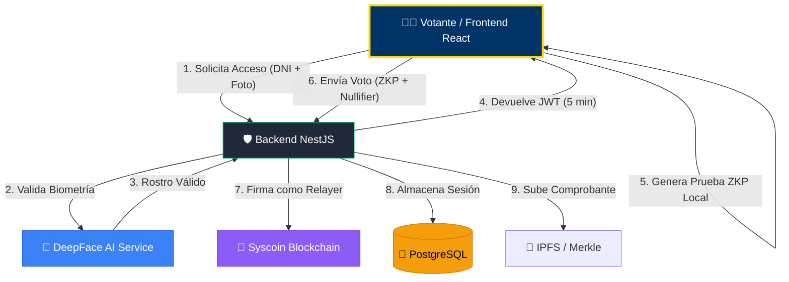

# 🏛️ UNT Digital Voting System

Un sistema robusto de votación universitaria de vanguardia, diseñado específicamente para la **Universidad Nacional de Trujillo (UNT)**. Combina la inmutabilidad de la **Blockchain (Syscoin)**, la privacidad total de las **Zero-Knowledge Proofs (ZKP)** y la seguridad biométrica de **Inteligencia Artificial (DeepFace)**.


---

## 🎯 Arquitectura del Sistema

El ecosistema está fragmentado en microservicios especializados para garantizar escalabilidad, anonimato y una barrera antifraude inquebrantable.



---

## 🚀 Guía de Instalación y Despliegue

Todo el sistema está orquestado a través de **Docker**. No necesitas instalar bases de datos manuales ni configurar scripts de Inteligencia Artificial locales.

### 1. Requisitos Previos
* [Docker Desktop](https://www.docker.com/) o Docker Engine instalado.
* Node.js v20+ (Para desarrollo).

### 2. Levantar la Infraestructura

Ejecuta el siguiente comando en la raíz del proyecto para ensamblar los contenedores de la Base de Datos, Redis, el Backend (NestJS), el servicio de Python (DeepFace) y el Frontend (Vite).

```bash
cd docker
docker compose up -d --build
```

### 3. Población de Base de Datos (Seeding)
Una vez que los contenedores estén activos (`docker compose ps`), debes inyectar la sesión electoral activa y los candidatos de la UNT para empezar a probar el sistema:

```bash
# Ingresar al contenedor de base de datos e inyectar el código
docker exec -i docker-postgres-1 psql -U postgres -d unt_voting < seed.sql
```
*(Si no tienes el archivo `seed.sql` mapeado, puedes ejecutar directamente en el backend `npm run seed` asumiendo que tienes las credenciales correctas).*

### 4. Accesos a la Aplicación
- **Frontend Votante & Admin:** [http://localhost:3000](http://localhost:3000)
- **Backend / GraphQL:** [http://localhost:4000/graphql](http://localhost:4000/graphql)
- **Microservicio IA (Interno):** `http://localhost:5000`

---

## ⚙️ Flujo del Votante (Zero-Knowledge y Biometría)

A diferencia de las dApps tradicionales donde el usuario requiere instalar MetaMask o poseer una Wallet con criptomonedas, el **UNT Voting System** absorbe esa fricción. El votante usa sus credenciales del mundo real y el sistema delega las transacciones Blockchain al servidor (Relayer).

### 👣 Paso a Paso del Sufragio

#### Fase 1: Control de Acceso e Identidad
1. **Acceso al Padrón:** El usuario entra a la aplicación y debe identificarse. Puede elegir su rol (Docente o Estudiante).
2. **Validación Institucional:** Si es Estudiante, ingresará su `DNI` o su `Carnet Universitario`.
3. **Escáner Biométrico (Liveness):** La web solicita permisos de cámara y toma una fotografía del rostro en tiempo real. Esta imagen se envía codificada en Base64 al backend, quien la cruza con el modelo `Facenet512` del servicio en Python (DeepFace) para corroborar la identidad contra RENIEC/SIU.

#### Fase 2: Cuarto Oscuro Temporal
4. **Token de Votación:** Al pasar el filtro biométrico, se emite un JWT (`JSON Web Token`) estrictamente temporal (válido solo por 5 minutos).
5. **Cuenta Regresiva:** Un reloj en pantalla le indica al elector su tiempo restante. Solo bajo este estado se iluminan y habilitan los botones para escoger candidato.

#### Fase 3: Emisión de Voto Privado
6. **Magia ZKP:** El elector escoge al candidato. El navegador web utiliza *snarkjs* y *Circom* para calcular un comprobante matemático (Zero-Knowledge Proof) localmente. Esto demora un par de segundos y genera un `nullifierHash`. 
7. **Anonimato Asegurado:** La identidad del usuario queda en su computadora. Al servidor solo se manda el "hash" ciego. El servidor actúa de **Relayer** y paga la comisión de red (Gas) para firmar la transacción en el Smart Contract de **Syscoin Testnet**.

#### Fase 4: Auditoría y Comprobante
8. **Transacción Confirmada:** El contrato recibe el `nullifierHash` y rechaza la transacción si este votante intenta sufragar dos veces.
9. **Recibo Criptográfico:** La web muestra una boleta exitosa de color verde, junto al **Hash del Voto** y un código **QR**. Este comprobante puede ser impreso y usado para auditar el bloque en el Panel de Administración o en el Syscoin Block Explorer (`sysscan.io`), demostrando que su voto entró en la urna inalterado, sin que nadie sepa jamás por quién votó.

---

## 🔒 Zona Administrativa (Panel de Control)

Las rutas de configuración están resguardadas por un Login interno (`/login`) que despliega herramientas solo para la ONPE o Tribunal Universitario:

- **Usuario default:** `admin`
- **Contraseña default:** `admin123`

Desde el panel, el administrador puede:
* **Crear Sesiones:** Agendar las fechas de inicio y fin de una elección.
* **Añadir Candidatos:** Insertar partidos y postulantes que se enlazarán a la Sesión seleccionada.
* **Auditoría en Vivo:** Ver la construcción en tiempo real del Árbol de Merkle (Merkle Tree) y monitorizar picos de tráfico en la base de datos sin vulnerar o descifrar los votos individuales.
